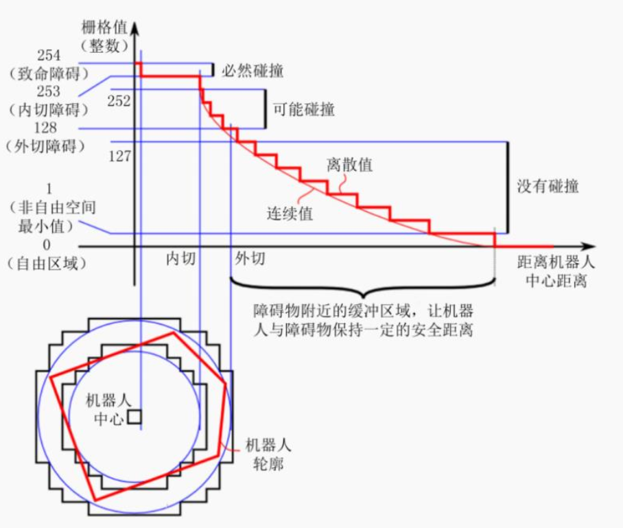

# 代价地图 (Cost Map)
代价地图（Cost Map）是一种用于导航和路径规划的二维栅格地图，其中每个单元格（格子或者像素）存储一个与移动“代价”相关的值。它常见于机器人导航领域，比如自主移动机器人中，用来表示环境中不同区域的通过性。

### 1. **代价地图的关键点：**
1. **表示什么：**
   - 每个单元格的值表示穿过该单元格的“代价”。代价通常是一个非负数，数值越高，说明通过该单元格的难度越大（比如更危险或不可通行）。
   
2. **代价来源：**
   - **障碍物：** 障碍物所在的单元格代价很高，通常被设置为无穷大或最大值，表示不可通行。
   - **安全距离：** 离障碍物越近的区域代价越高，表示需要更小心。
   - **导航偏好：** 根据机器人任务需求，特定区域可以设置不同的代价。例如，机器人可能更倾向于避开陡坡或某些地形。
   
3. **用途：**
   - **路径规划：** 代价地图是路径规划算法（如A*或Dijkstra）的输入，用于计算代价最低的路径。
   - **避障：** 代价地图可以帮助机器人避开障碍物或高代价区域。
   - **环境建模：** 帮助机器人理解环境中的通过性，并辅助决策。

---

### 2. **代价地图的组成：**

代价地图有两张:global_costmap(全局代价地图) 和 local_costmap(本地代价地图)，前者用于全局路径规划，后者用于本地路径规划。

两张代价地图都可以多层叠加,一般有以下层级:

    Static Map Layer：静态地图层，SLAM构建的静态地图。

    Obstacle Map Layer：障碍地图层，传感器感知的障碍物信息。

    Inflation Layer：膨胀层，在以上两层地图上进行膨胀（向外扩张），以避免机器人的外壳会撞上障碍物。

    Other Layers：自定义costmap。

多个layer可以按需自由搭配。

### 3. 碰撞算法

在ROS中，如何计算代价值呢？请看下图:

上图中，横轴是距离机器人中心的距离，纵轴是代价地图中栅格的灰度值。

    致命障碍:栅格值为254，此时障碍物与机器人中心重叠，必然发生碰撞；
    内切障碍:栅格值为253，此时障碍物处于机器人的内切圆内，必然发生碰撞；
    外切障碍:栅格值为[128,252]，此时障碍物处于其机器人的外切圆内，处于碰撞临界，不一定发生碰撞；
    非自由空间:栅格值为(0,127]，此时机器人处于障碍物附近，属于危险警戒区，进入此区域，将来可能会发生碰撞；
    自由区域:栅格值为0，此处机器人可以自由通过；
    未知区域:栅格值为255，还没探明是否有障碍物。

膨胀空间的设置可以参考非自由空间。