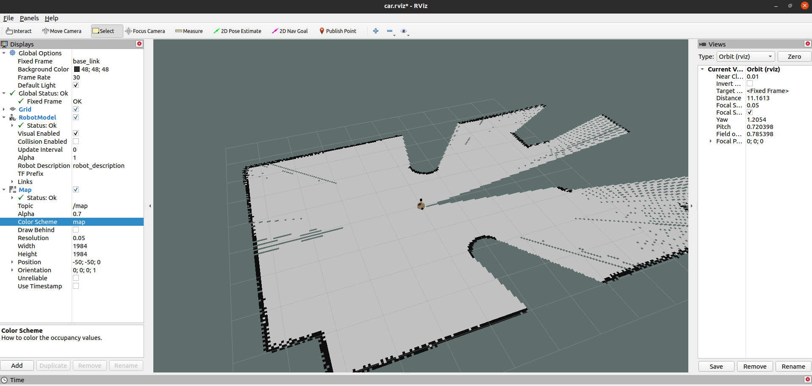
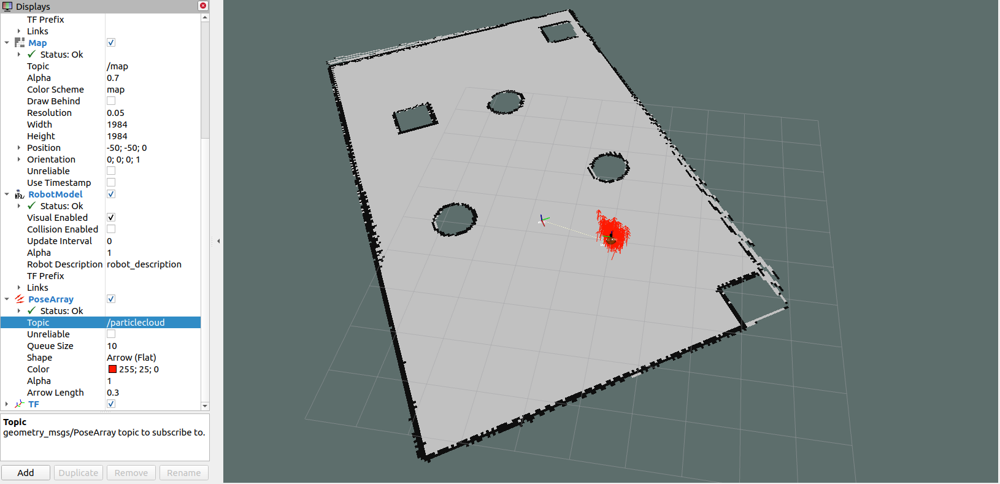
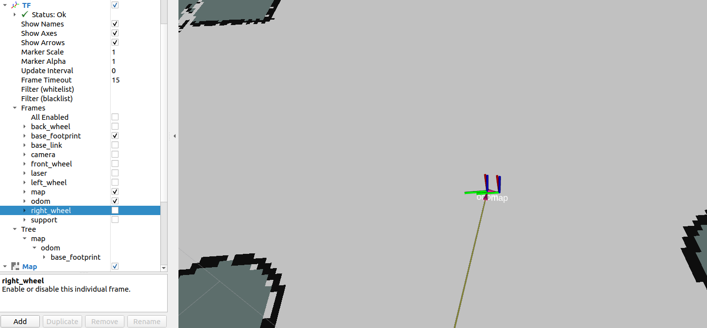

# Chapter7 机器人导航

- 大部分内容参见[Autolabor第 7 章 机器人导航(仿真)](http://www.autolabor.com.cn/book/ROSTutorials/di-7-zhang-ji-qi-ren-dao-822a28-fang-771f29.html)

## 功能包说明
- 7_2navigation 实现了

        7.2.1 导航实现01_SLAM建图
        7.2.2 导航实现02_地图服务
        7.2.3 导航实现03_定位
        7.2.4 导航实现04_路径规划
        7.2.5 导航与SLAM建图

    通过不同的launch文件启动

---

## 内容补充

### 7.2.1 SLAM建图步骤
1. 先启动 Gazebo 仿真环境:
    ```bash
    cd Chapter6_Simulation/
    source ./devel/setup.bash
    roslaunch 6_6gazebo car.launch
    ```

2. 然后再启动地图绘制的 launch 文件(再开一个终端):
    ```bash
    cd Chapter7_Navigation/
    source ./devel/setup.bash
    roslaunch 7_2navigation nav01_slam.launch
    ```

3. 启动键盘键盘控制节点，用于控制机器人运动建图:
    ```bash
    sudo apt install ros-noetic-teleop-twist-keyboard
    rosrun teleop_twist_keyboard teleop_twist_keyboard.py
    ```
4. 在 rviz 中添加组件，显示栅格地图:


### 7.2.3 定位建图步骤
1. 同上

2. 启动键盘控制节点：
    ```bash
    rosrun teleop_twist_keyboard teleop_twist_keyboard.py
    ```

3. 启动集成地图服务、amcl的 launch 文件：
    ```bash
    cd Chapter7_Navigation/
    source ./devel/setup.bash
    roslaunch 7_2navigation test_amcl.launch
    ```
4. 在启动的 rviz 中，添加RobotModel、Map组件，分别显示机器人模型与地图，添加 posearray 插件，设置topic为particlecloud来显示 amcl 预估的当前机器人的位姿，箭头越是密集，说明当前机器人处于此位置的概率越高；

5. 通过键盘控制机器人运动，会发现 posearray 也随之而改变。


### 7.2.4 路径规划启动步骤
1. 直接roslaunch 7_2navigation nav06_test.launch

2. 在rviz添加各个组件

3. 通过Rviz工具栏的 2D Nav Goal设置目的地实现导航。

---

## 有关知识点
### 7.1.2 坐标系单继承关系：map->odom->机器人模型中的根坐标系


### 7.2.4 [代价地图](./Costmap.md)

### 7.2.4 [move_base功能包](./move_base.md)
---

## 有关问题
### 7.2.2 map_server保存图片：
1. 你需要自己执行一遍：
    ```bash
    roslaunch 7_2navigation nav02_map_save.launch
    ```
    因为.yaml文件的image路径需要定位到对应的目录
### 7.2.4 单个launch统一启动所有节点
1.  
    1) 问题：
        6_6gazebo使用频率比较高，将他放到nav06_test.launch中，执行
        ```bash
        source ~/rosWork/Chapter6_Simulation/devel/setup.bash
        source ~/rosWork/Chapter7_Navigation/devel/setup.bash
        roslaunch 7_2navigation nav06_test.launch
        会报错：
        Resource not found: 6_6gazebo
        ROS path [0]=/opt/ros/noetic/share/ros
        ROS path [1]=/home/hanyi/rosWork/Chapter7_Navigation/src
        ROS path [2]=/opt/ros/noetic/share
        The traceback for the exception was written to the log file
        ```
        如果你先执行 source 一个工作空间的 setup.bash，然后执行另一个工作空间的 setup.bash，后一个会覆盖前一个的环境变量，导致之前的工作空间路径丢失。

        哪怕
        ```bash
        source ~/rosWork/Chapter6_Simulation/devel/setup.bash >> ~/.bashrc 
        ```
        也是一样的

    2) 解决方法：
        1) 编辑 ~/.bashrc，并添加以下内容：
        ```bash
        export ROS_PACKAGE_PATH=~/rosWork/Chapter6_Simulation/src:~/rosWork/Chapter7_Navigation/src:$ROS_PACKAGE_PATH
        ```
        这样，ROS_PACKAGE_PATH 会包含两个工作空间的 src 路径。

        2) 保存并刷新 .bashrc：
        ```bash
        source ~/.bashrc
        ```

        验证是否正确： 运行以下命令查看 ROS_PACKAGE_PATH 是否包含两个工作空间：
        ```bash
        echo $ROS_PACKAGE_PATH
        ```

        输出应该是：
        ```bash
        /home/hanyi/rosWork/Chapter6_Simulation/src:/home/hanyi/rosWork/Chapter7_Navigatio
        ```
